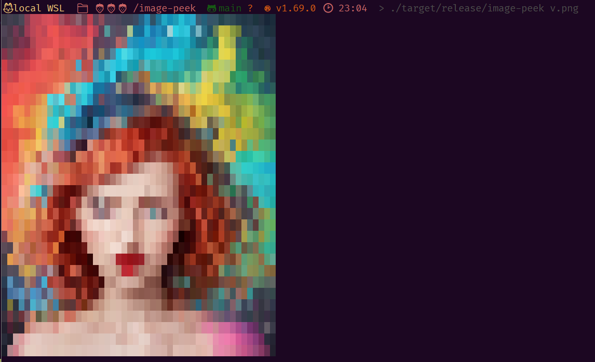
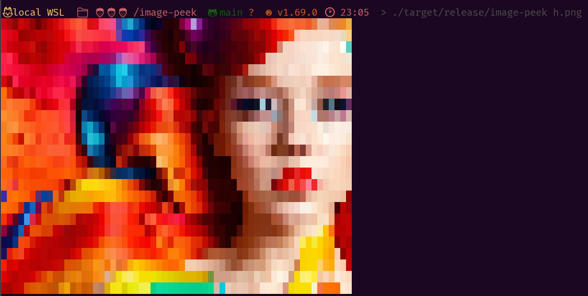

# image peek

this is a small utility application written in rust to preview images in the terminal.

## usage

image-peek [image-file-path] [optional: bw]

* bw = black and white (uses no colors, just utf dittered characters)

## examples

